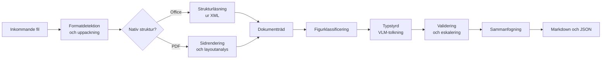

# PRD: lokal pipeline för dokumenttolkning till text

Sep 23, 2026 · Joel Stenberg

## Sammanfattning och problem

Vi föreslår en lokal tjänst som gör om vilket dokument som helst till text där även diagram, grafer och processkisser blir läsbar, strukturerad text. Den ska gå att köra helt lokalt och utan nätverk, både på en Mac med Apple Silicon och 48 GB minne och på en Linux-server med GPU, med samma API och samma utdataformat.

Problemet är att en LLM bakom ett harness bara ser det som extraheringen lämnar efter sig. Klassiska verktyg (pdftotext, python-docx) tappar bilder helt. OCR fångar texten i en bild men inte betydelsen: pilar, relationer, axlar, flödesordning och vad en färg markerar.

De nya dokument-VLM:erna (vision-language models, språkmodeller som tar bilder som indata) är mycket bättre, men de optimeras mot benchmarks som OmniDocBench. Den mäter text, tabeller, formler och läsordning, inte om en processkiss blev begriplig. Det gapet är troligen där den här tjänsten behöver göra sin egen insats, och det är också det som behöver valideras först.

Kärnidén i förslaget, som en hypotes att pröva snarare än en slutsats:

- Låt en specialiserad, liten dokumentparser sköta text, tabeller, formler och layout, där den är stark och billig.
- Skicka varje figur vidare till en generell VLM med en typstyrd prompt (flödesschema, graf, organisationsskiss, foto) som ger en strukturerad beskrivning, till exempel Mermaid för processer och nyckelvärden per serie för grafer.
- Mät kvaliteten på egna utvärderingsdokument med frågor som bara går att besvara om figuren tolkats rätt.

## Mål, icke-mål och framgångsmått

Målet är att en LLM som bara får tjänstens textutdata ska kunna svara på ungefär lika många frågor om dokumentet som en människa som ser originalet. Siffrorna nedan är preliminära och bör kalibreras efter fas 1.

### Mål

1. Ta emot PDF (digitalt född, skannad, blandad), DOCX och PPTX i första versionen. Övriga vanliga format (XLSX/XLS/CSV, DOC/PPT, ODF, RTF, HTML, EML/MSG med bilagor, PNG/JPEG/TIFF, TXT, Markdown) läggs till i fas 4, när värdet är visat.
2. Tolka figurer till text som fångar betydelse, inte bara synlig text: noder och kanter i processer, serier och värden i grafer, hierarkier i organisationsskisser.
3. Köra helt lokalt utan nätverksanrop, med alla modellvikter paketerade i förväg.
4. Samma API och samma utdataschema oavsett om körningen sker på Mac eller på GPU-server.
5. Spårbarhet: varje block pekar på källsida och koordinater, och är märkt som extraherat (lästes ur filen) eller tolkat (genererat av en modell).

### Icke-mål

- Chunkning, embeddings och sökindex. Det gör konsumenten, till exempel en RAG-pipeline eller en MCP-server.
- Att återskapa dokumentets visuella layout.
- Översättning och sammanfattning av hela dokument.
- Låg latens för interaktiv användning i första versionen. Batch räcker.

### Framgångsmått

| Mått | Hur det mäts | Preliminärt mål |
| --- | --- | --- |
| Figurförståelse | Andel av gapet mellan golv och tak som pipelinen stänger på figurfrågor (se Utvärdering) | ≥ 85 % |
| Påhittade figurdetaljer | Andel påståenden i figurbeskrivningar som inte stöds av bilden, stickprov | ≤ 3 % |
| Textkvalitet, digitalt född PDF | Normaliserad edit distance mot facit | ≤ 0,02 |
| Textkvalitet, skannat | Normaliserad edit distance mot facit | ≤ 0,06 |
| Tabeller | TEDS mot facit | ≥ 0,90 |
| Robusthet | Andel filer som ger giltig utdata utan krasch | ≥ 99 % |
| Tid per figur | Sekunder per figur på Mac-profilen | ≤ 10 s, vilket motsvarar en budget på ungefär 150–250 genererade tokens per figur |
| Genomströmning | Sidor per minut per profil | Mäts i fas 1, mål sätts efter det |

Tiden styrs nästan helt av hur många tokens figurtolkaren genererar. En lokal MoE-modell i Gemma 4-klassen genererar runt 40 tokens per sekund på en M4 Mac, så 600 tokens per figur blir cirka 15 sekunder, och ett dokument med 50 figurer tar då över tio minuter. Tokenbudgeten per figur är därför ett designkrav, inte en optimering.

## Användare och användningsfall

Den primära användaren är inte en människa utan en annan tjänst: ett agent-harness, en RAG-pipeline eller en MCP-server. Människor möter tjänsten främst när de granskar kvalitet.

| Användare | Användningsfall | Vad de behöver av utdata |
| --- | --- | --- |
| Agent bakom harness | Läser ett dokument mitt i en uppgift och ska förstå en processkiss eller ett beslutsflöde | Kompakt Markdown, figurer som Mermaid eller punktlistor, hänvisning till sida |
| RAG-pipeline | Indexerar stora dokumentmängder, besvarar frågor om värden i grafer | Block med typ, sida och koordinater för chunkning och citat |
| MCP-server | Exponerar dokument som verktyg för LLM:er | Stabilt JSON-schema, möjlighet att hämta enskilda figurer i högre detalj |
| Utvärderare | Jämför parsers och modellversioner på utvärderingsdokumenten | Deterministiska körningar, versionsmärkt utdata, sparade mellanresultat |
| Utvecklare på Mac | Prototyper och felsöker offline | Samma CLI och API lokalt, rimlig tid för dokument på 20 till 50 sidor |

## Landskapet: ramverk och modeller

Inget enskilt open source-projekt verkar täcka hela kravet, men kombinationen av ett orkestreringsramverk och utbytbara modeller kommer långt. Rangordningen skiljer sig mycket mellan benchmarks, vilket talar för att valet bör göras mot egna dokument och inte mot topplistor. Läget avser september 2026.

### Vad benchmarkarna mäter, och inte mäter

- [OmniDocBench](https://github.com/opendatalab/OmniDocBench) v1.6 mäter text, tabeller, formler och läsordning på 1 651 sidor. Figurer ingår som layoutklass men deras innehåll poängsätts inte.
- [ParseBench](https://www.llamaindex.ai/blog/parsebench) (LlamaIndex, april 2026) mäter även grafer som enskilda datapunkter, på cirka 2 000 sidor från försäkring, finans och offentlig sektor. Den är framtagen av en leverantör, så resultaten bör läsas med viss försiktighet.
- Modeller som toppar OmniDocBench hamnar betydligt lägre på [ParseBench-listan](https://benchmarklist.com/benchmarks/parsebench/), till exempel en tidigare PaddleOCR-VL på 40,9 och MinerU2.5 på 45,9, medan Chandra 2 ligger på 70,1.
- Processkisser och flödesscheman täcks inte av någon av dem. För just det som motiverar projektet finns alltså troligen inget färdigt mått.

### Orkestreringsramverk

| Ramverk | Styrka | Figurhantering | Mac | Licens | Bedömning |
| --- | --- | --- | --- | --- | --- |
| [Docling](https://docling-project.github.io/docling/usage/supported_formats/) | Bredast formatstöd: PDF, Office inklusive äldre format via LibreOffice, ODF, e-post (EML, MSG), XBRL, HTML, bilder. Utbytbar modell per steg. API-server och MCP-server finns | [Figurklassificerare](https://docling-project.github.io/docling/usage/model_catalog/) (graf, diagram, foto) och figurbeskrivning via lokal VLM eller OpenAI-kompatibelt API | Ja, MLX-motor. TableFormer körs inte på MPS | MIT (kontrollera) | Förslag till ryggrad |
| [MinerU](https://opendatalab.github.io/MinerU/reference/changelog/) 3.x | Nativ DOCX, PPTX och XLSX. Backends för pipeline, VLM och hybrid, med vLLM, LMDeploy och MLX | MinerU2.5-Pro tolkar bilder och grafer, slår ihop tabeller över sidbrytningar | Ja, via MLX | [Egen licens](https://github.com/opendatalab/MinerU/blob/master/LICENSE.md) baserad på Apache 2.0 med tilläggsvillkor | Stark parser, kräver licensgranskning |
| [NeMo Retriever Library](https://docs.nvidia.com/nemo/retriever/latest/extraction/overview/) (tidigare nv-ingest) | Text, tabeller, grafer och infografik ur PDF, Office, HTML, bilder. Kör via NIM eller lokala Nemotron-modeller | Grafer via layoutdetektion och OCR, övriga bilder får VLM-bildtext | Nej, Linux och CUDA | NVIDIA-villkor | Passar en GPU-server, inte Mac-kravet. Bra jämförelsepunkt |
| [Chandra 2](https://github.com/datalab-to/chandra) och Marker (Datalab) | Stark på ParseBench och olmOCR-bench | Förbättrad bildbeskrivning i version 2 | Oklart | Vikterna kräver kommersiell licens vid egen drift | Endast som referens om licens inte köps |

### Sidparsers (text, tabeller, layout)

| Modell | Storlek | Ursprung | Licens | OmniDocBench v1.6 | Notering |
| --- | --- | --- | --- | --- | --- |
| [PaddleOCR-VL-1.6](https://huggingface.co/PaddlePaddle/PaddleOCR-VL-1.6/blob/main/README.md) | 0,9B | Baidu | Apache 2.0 | 96,34 | Högst på OmniDocBench, även graftolkning |
| [MinerU2.5-Pro](https://opendatalab.github.io/MinerU/reference/changelog/) | 1,2B | OpenDataLab | MinerU-licens | 95,75 | Förinställning finns i Docling |
| [GLM-OCR](https://github.com/opendatalab/OmniDocBench) | 0,9B | Zhipu | Ej kontrollerad | 95,22 |  |
| [Nemotron Parse 2.0](https://catalog.ngc.nvidia.com/orgs/nim/nvidia/models/nemotron-parse-v2.0) | 0,9B | NVIDIA | NVIDIA Open Model License, kommersiell användning tillåten | Ej listad | Graf till tabell, förinställning i Docling med MLX |
| [Granite-Docling-258M](https://huggingface.co/ibm-granite/granite-docling-258M) | 258M | IBM | Apache 2.0 | Ej listad | Liten och snabb, inte avsedd för generell bildförståelse |
| [olmOCR](https://github.com/opendatalab/OmniDocBench) | 7B | Allen AI | Ej kontrollerad | 85,74 (version 1) | Version 2 får 82,4 på olmOCR-bench |

Sidparsers faller ungefär i tre familjer med olika styrkor:

| Familj | Hur den fungerar | Exempel | Styrka | Svaghet |
| --- | --- | --- | --- | --- |
| Klassisk pipeline | En layoutmodell ritar rutor runt block, separata modeller tar tabeller och OCR, textlagret läses direkt när det finns | Doclings standardpipeline (Heron, TableFormer) | Förutsägbar och snabb, liten risk för påhittad text | Svagare på rörig layout och dåliga skanningar |
| Tvåstegs-VLM | Layoutdetektion först, sedan tolkar en liten VLM varje beskuret område för sig | PaddleOCR-VL-1.6, MinerU2.5-Pro | Toppar OmniDocBench, precisa koordinater per område | Beroende av att layoutsteget hittar rätt rutor |
| Helsidig VLM | Hela sidan in, strukturerad text ut | Nemotron Parse 2.0, Chandra 2, olmOCR 2, dots.ocr, Granite-Docling | Helhetsgrepp om komplex layout och läsordning | Kan hoppa över eller hitta på text, svårare att spåra |

Två saker påverkar planen. Nästan alla är tränade främst på engelska och kinesiska, och OmniDocBench mäter bara de språken, så kvaliteten på svenska är okänd tills den mäts (H8). Docling har förinställningar för MinerU2.5-Pro, Nemotron Parse 2.0 och Granite-Docling, så familjerna kan jämföras inom samma ramverk med liten extra kod (H9).

### Figurtolkare

För själva figurförståelsen verkar en generell VLM behövas. Små specialiserade parsers läser text i figurer men är inte byggda för att resonera om dem.

- [Gemma 4](https://lmstudio.ai/models/gemma-4) finns som E2B, E4B, 26B A4B och 31B, med bildinmatning och MLX-versioner. 26B A4B i 4 bitar bör rymmas på en 48 GB Mac med marginal. Gemma 4 resonerar ("thinking") som standard och kan då förbruka hela tokenbudgeten innan den svarar. Det stängs av med `reasoning_effort: none` i OpenAI-kompatibla anrop.
- En [Qwen3-VL-8B finjusterad för flödesschema till Mermaid](https://featherless.ai/models/DangIT02/qwen3vl-flowchart-to-mermaid_v3) når nod-F1 0,825 men tappar pilriktning i scheman över 20 noder och är bara testad på engelska etiketter. Det antyder att relationer och pilar är den svåra delen.
- Docling använder redan Granite Vision 4.1 för tabellstruktur och grafextraktion, och Nemotron Parse 2.0 har en egen grafklass som ger tabell.

Flera av de starkaste modellerna kommer från kinesiska organisationer. Det kan bli en styrnings- och förtroendefråga för vissa användare oberoende av teknisk kvalitet, så arkitekturen bör göra modellen utbytbar per steg.

## Föreslagen arkitektur

Arkitekturen bygger på två principer: läs källdata före pixlar, och tolka varje figur separat med en prompt som styrs av figurens typ. Docling föreslås som ryggrad eftersom det redan har formatstöd, dokumentträd och utbytbara modellsteg, men varje steg ska kunna bytas.



Filer går in till vänster. Nativa format läses som struktur, PDF som sidbilder, och båda vägarna möts i ett gemensamt dokumentträd där figurerna sedan tolkas en och en.

### Steg för steg

1. **Formatdetektion och uppackning.** Avgör format på innehåll, inte filändelse. I senare faser: packa upp behållare (e-post med bilagor, ZIP, inbäddade OLE-objekt) och konvertera äldre binärformat till OOXML med LibreOffice headless och EMF/WMF-bilder till PNG.
2. **Strukturläsning för nativa format.** Läs text, rubriker och tabeller direkt ur XML. Två fall är särskilt värdefulla: inbäddade diagram i Office bär sina datavärden i diagram-XML, och SmartArt och figurer med kopplingslinjer bär noder och kanter explicit. Där kan grafen återskapas utan att någon modell gissar.
3. **Sidrendering och layoutanalys för PDF.** Använd textlagret när det finns och är rimligt, OCR bara där det saknas eller är trasigt (felaktig teckenkodning förekommer). Layoutmodellen ger block med typ och koordinater: text, rubrik, tabell, formel, figur, bildtext.
4. **Figurklassificering.** Varje figur beskärs i hög upplösning (runt 200 till 300 DPI) och får ett kontextpaket: bildtexten eller figurrubriken, anmärknings- och källraden under figuren, de meningar i dokumentet som hänvisar till figuren (till exempel "se diagram 7") och avsnittsrubriken. En klassificerare avgör typ. Dekor och logotyper hoppas över. Figurdetektionen måste ha hög recall även för vektorgrafik; tappar klassificeraren figurer är alternativet att fånga alla kandidatregioner och låta VLM:en sätta typen i samma anrop som tolkningen (se H10).
5. **Typstyrd VLM-tolkning.** Varje typ har en egen prompt och ett eget utdataschema, se tabellen nedan. Varje prompt har en tokenbudget.
6. **Validering och eskalering.** Billiga kontroller först. Klarar figuren dem inte går den vidare till en större modell eller märks med låg tillförlitlighet.
7. **Sammanfogning.** Figurbeskrivningen placeras där figuren stod, märkt som tolkad, med sidnummer och koordinater. Utdata serialiseras som Markdown för LLM och som JSON med hela strukturen.

### Figurtyper och utdata

| Figurtyp | Utdata | Validering |
| --- | --- | --- |
| Flödesschema, processkiss, BPMN | Mermaid plus numrerad steglista med beslut och förgreningar | Mermaid parsar; all OCR-text i bilden finns med som nod eller kant |
| Stapel-, linje-, cirkeldiagram | Titel, axlar, enheter, serier och per serie nyckelpunkter (start, slut, högsta och lägsta med tidpunkt, vändpunkter), ungefärliga värden märkta, en mening om huvudbudskapet. Full datatabell hämtas vid behov via `reinterpret` med högre detaljnivå | Axeletiketter och serienamn matchar OCR; värden inom axelns intervall |
| Organisationsskiss, hierarki | Nästlad lista | Alla rutor återfinns; en rot |
| Arkitektur- och blockdiagram | Komponentlista plus kopplingar som Mermaid | Som flödesschema |
| Tabell som bild | Markdown-tabell | Antal rader och kolumner rimligt mot layout |
| Karta, foto, skärmdump | Kort beskrivning, synlig text ordagrant | Textöverlapp mot OCR |
| Dekor, logotyp | Hoppas över eller en rad | Ingen |

Figurbeskrivningar tar inte med färger, linjetyper eller layout om de inte bär betydelse (till exempel utfall mot prognos). Det är tokens som inte hjälper en nedströms-LLM.

### Förstahandsval per komponent

| Steg | Förstahandsval | Alternativ att pröva |
| --- | --- | --- |
| Äldre format (fas 4) | LibreOffice headless | Apache Tika för ren text |
| Nativ struktur | Docling-backends plus egen läsare för diagram-XML och kopplingslinjer | MinerU:s nativa DOCX, PPTX, XLSX |
| PDF-layout och OCR | Docling standardpipeline | PaddleOCR-VL-1.6, MinerU2.5-Pro, Nemotron Parse 2.0 som sidparser |
| Figurklassificering | Doclings DocumentFigureClassifier-v2.5 | Typ satt av VLM:en i tolkningsanropet; liten VLM med fler klasser |
| Figurtolkning | Gemma 4 26B A4B | Större VLM på GPU-server, finjusterad flödesschemamodell |
| Modellservering | vLLM på GPU-server, mlx-vlm på Mac, allt bakom OpenAI-kompatibla endpoints | Ollama på Mac |

Att alla modellanrop går via OpenAI-kompatibla endpoints gör att byte av modell blir en konfigurationsfråga, och att samma kod kan köras på båda plattformarna.

## Driftmiljöer

Samma kod och samma API körs i båda miljöerna. Skillnaden ligger i en profilfil som väljer inferensmotor och modellstorlek per steg.

| Aspekt | Mac, Apple Silicon, 48 GB | GPU-server, Linux och CUDA |
| --- | --- | --- |
| Syfte | Utveckling, felsökning, mindre batcher offline | Stora körningar och utvärdering |
| Inferensmotor | MLX via mlx-vlm-server, OpenAI-kompatibelt | vLLM, OpenAI-kompatibelt |
| Sidparser | Docling standardpipeline, eller en sidparser på under 2B i MLX | Samma, eller flera parsers parallellt för jämförelse |
| Figurtolkare | Gemma 4 26B A4B i 4 bitar, uppskattningsvis 15 till 17 GB inklusive cache | Större VLM för eskalering, mindre VLM för första försöket |
| Kända begränsningar | TableFormer körs på CPU eftersom MPS är avstängt för den i Docling | Kontrollera minnesbehov per modell om flera delar samma GPU |
| Förväntad flaskhals | Figurtolkningen, sekventiellt | Kö och fördelning mellan modeller som delar GPU |

Minnesuppskattningen för Mac är ungefärlig och bör verifieras i fas 2, när figurtolkaren först körs lokalt. Med cirka 16 GB för operativsystem och verktyg finns ändå troligen marginal för sidparser och layoutmodeller samtidigt.

### Krav för drift utan nätverk

- Alla modellvikter hämtas i förväg till en lokal modellkatalog med fastlåsta versioner och kontrollsummor.
- Containeravbilder byggs utanför och förs in som filer, med SBOM och licenslista per avbild.
- Offline-lägen tvingas i konfigurationen (till exempel `HF_HUB_OFFLINE=1`), telemetri stängs av, och utgående trafik blockeras även på nätverksnivå.
- Ett integrationstest körs med nätverket helt avstängt (`--network none`) och ska ge identisk utdata som med nätverk. Det fångar dolda nedladdningar, som modeller som hämtas vid första anrop.
- Varje körning loggar modellnamn, version och kontrollsumma i utdatats metadata.

## API

API:t är asynkront och jobbaserat, med ett synkront genvägsanrop för små filer. Utöver helheten kan en agent hämta och tolka om enskilda figurer, vilket ger en naturlig väg att zooma in när den första beskrivningen inte räcker.

### Endpoints

| Metod | Sökväg | Syfte |
| --- | --- | --- |
| POST | `/v1/jobs` | Skapa jobb från uppladdad fil eller sökväg i delad lagring |
| POST | `/v1/convert` | Synkron konvertering för små filer, till exempel under 20 sidor |
| GET | `/v1/jobs/{job_id}` | Status, framsteg per sida, varningar |
| GET | `/v1/jobs/{job_id}/result?format=markdown\|json\|text` | Resultatet i valt format |
| GET | `/v1/jobs/{job_id}/figures` | Lista över figurer med typ, sida och tillförlitlighet |
| GET | `/v1/jobs/{job_id}/figures/{figure_id}` | En figur: beskuren bild, tolkning, kontroller, rå modellutdata |
| POST | `/v1/jobs/{job_id}/figures/{figure_id}/reinterpret` | Tolka om med annan modell, prompt eller detaljnivå |
| GET | `/v1/jobs/{job_id}/pages/{n}/image` | Renderad sidbild för granskning eller visuell reserv |
| DELETE | `/v1/jobs/{job_id}` | Radera jobb och mellanresultat |
| GET | `/v1/capabilities` | Format, aktiv profil, modeller med versioner |
| GET | `/v1/health` | Hälsa per ingående tjänst |

Samma funktioner exponeras som MCP-verktyg, till exempel `convert_document`, `get_figure` och `reinterpret_figure`, så att en MCP-server eller ett agent-harness kan bygga direkt på tjänsten.

### Jobbparametrar

| Parameter | Värden | Standard |
| --- | --- | --- |
| `profile` | `mac-local`, `gpu-default`, `gpu-max` | Enligt driftmiljö |
| `figures` | `off`, `caption`, `describe`, `structured` | `structured` |
| `figure_escalation` | `none`, `on_low_confidence`, `always` | `on_low_confidence` |
| `outputs` | `markdown`, `json`, `text` (flera tillåts) | `markdown`, `json` |
| `pages` | Intervall, till exempel `1-10,15` | Alla |
| `language_hint` | BCP-47, till exempel `sv`, `en` | Automatisk |
| `ocr` | `auto`, `force`, `off` | `auto` |
| `include_images` | `none`, `figures`, `pages` | `figures` |

Samma fil med samma profil och parametrar ger ett cachat svar, nycklat på filens SHA-256 och pipelineversionen.

### Utdataschema (JSON, förkortat)

```json
{
  "job_id": "job_01JAB3",
  "source": { "filename": "rapport.pdf", "sha256": "9f2c…", "mime": "application/pdf", "pages": 42 },
  "pipeline": {
    "version": "0.1.0",
    "profile": "mac-local",
    "models": { "layout": "docling-layout-heron@abc123", "figures": "gemma-4-26b-a4b@def456" }
  },
  "blocks": [
    { "id": "b41", "type": "heading", "level": 2, "text": "3. Beslutsprocessen", "page": 8, "bbox": [72, 88, 520, 110], "origin": "extracted" },
    {
      "id": "f3", "type": "figure", "figure_type": "flowchart", "page": 8, "bbox": [72, 130, 540, 610],
      "caption": "Figur 3. Handläggning av ärende", "origin": "interpreted",
      "interpretation": {
        "summary": "Ärendet kontrolleras för komplettering innan handläggning.",
        "mermaid": "flowchart TD\n A[Ärende inkommer] --> B{Komplett?}\n B -- Ja --> C[Handläggning]\n B -- Nej --> D[Begär komplettering]\n D --> A",
        "ocr_text": ["Ärende inkommer", "Komplett?", "Ja", "Nej", "Handläggning", "Begär komplettering"],
        "checks": { "mermaid_parses": true, "ocr_coverage": 1.0 },
        "confidence": 0.86,
        "model": "gemma-4-26b-a4b",
        "output_tokens": 142,
        "escalated": false
      }
    }
  ],
  "warnings": [ { "code": "ocr_fallback", "page": 12, "detail": "Textlagret saknade teckenmappning" } ]
}
```

### Figurblock i Markdown

I Markdown-utdata ersätts figuren av en kommentarsrad med metadata, en rubrikrad och sammanfattningen, följt av ett Mermaid-block eller en tabell beroende på typ:

```markdown
<!-- figure id=f3 page=8 type=flowchart origin=interpreted confidence=0.86 -->
**Figur 3 (s. 8): Handläggning av ärende.** Tolkad figur. Ärendet kontrolleras för komplettering innan handläggning.
```

Märkningen `origin=interpreted` gör att en konsument kan väga tolkat innehåll annorlunda än text som lästes direkt ur filen.

### Fel och delresultat

| Kod | Betydelse |
| --- | --- |
| 200 med `warnings` | Delvis lyckat, till exempel en sida gick inte att tolka |
| 413 | Filen överskrider konfigurerad gräns |
| 415 | Formatet stöds inte |
| 422 | Filen är krypterad eller skadad |
| 503 | Modelltjänst ej tillgänglig, jobbet ligger kvar i kön |

## Utvärdering

Huvudmåttet är frågebaserat: kan en LLM som bara läser utdata svara rätt på frågor som kräver figuren? Det mäter det projektet faktiskt bryr sig om, oberoende av om utdata är Mermaid, lista eller prosa. Strukturella mått och textmått fungerar som diagnos när frågemåttet visar problem.

Utvärderingsdokumenten är publika och finns på internet. Bara manifest och nedladdningsskript versioneras; filerna hämtas lokalt.

### Testmängd ur utvärderingsdokumenten

1. **Inventera.** Kör en billig första passering över hela mängden: format, sidantal, textlager ja eller nej, antal figurer per typ enligt klassificeraren.
2. **Stratifiera.** Välj ett urval som täcker format, figurtyper, språk (svenska och engelska) och kvalitet (digitalt född, skannad). En rimlig start kan vara 40 till 60 dokument med minst 150 figurer. Med 150 figurer och en träffsäkerhet kring 85 % blir osäkerheten ungefär plus minus 6 procentenheter, vilket räcker för att skilja stora skillnader men inte små.
3. **Frys.** Testmängden versioneras och ändras inte mellan jämförelser. Nya dokument läggs i en ny version.

### Frågor och svar

- **Kategoriska svar.** Varje fråga har ett svar som kan rättas mekaniskt: ett tal med angiven precision och tolerans ("i procent, en decimal", ±0,2), ja/nej, eller ett av listade alternativ. Då behövs ingen domarmodell för huvudmåttet.
- **Gissning ska inte löna sig.** Svarsmodellen får svara "okänt". Rätt svar räknas +1, "okänt" 0 och fel svar −1. Utan det blåses golvet upp av tur, särskilt på ja/nej- och flervalsfrågor.
- **Som konsumenten läser.** Svarsmodellen får utdata i retrieval-form: dokumentet chunkas, de mest relevanta chunkarna hämtas per fråga och bara de visas. Hela dokumentet i kontexten mäter något annat, eftersom en medelstor modell inte hittar en figurbeskrivning i tiotusentals tokens.
- **Många enkla frågor per figur.** Minst 5 per figur: värden vid namngivna punkter, tidpunkter för toppar och bottnar, vilken serie som är högst, riktning på slutet. Tio vanliga frågor är svårare att anpassa en prompt mot än två listiga.
- **Facit ur figuren.** Facit läses ur bilden av en människa, eller tas ur nativa filer (se nedan). Aldrig ur en modells beskrivning och aldrig ur utgivarens alt-texter.

Frågorna kan tas fram snabbare om en stark VLM föreslår dem och en människa granskar, eftersom dokumenten är publika. Förslagsmodellen bör komma från en annan modellfamilj än figurtolkaren för att inte gynna den. Svarsmodellen och figurtolkaren är alltid modeller som kan köras lokalt; under utveckling får de köras via en hostad endpoint för hastighet.

### Tre nivåer av mått

| Nivå | Mått | Facit | Kostnad |
| --- | --- | --- | --- |
| Figurfrågor (huvudmått) | Poäng enligt ovan, normerat mellan en golv- och en takbaslinje | Minst 5 frågor per figur med kategoriska svar, skrivna eller granskade av människa | Hög per figur, därför begränsat urval |
| Struktur | Nod-F1 och riktad kant-F1 för processer, andel datapunkter inom tolerans för grafer | Annoterade grafer och datapunkter på ett delurval, diagram-XML ur nativa filer | Medel |
| Påhittat innehåll | Andel påståenden i figurbeskrivningar som inte stöds av bilden | Stickprovsgranskning | Medel |
| Text och tabeller | Normaliserad edit distance, TEDS | Källfilernas egen text, se nedan | Låg |

### Golv, tak och normerat mått

För varje fråga körs samma svarsmodell i tre lägen: med enkel textextraktion utan figurer (golv), med pipelinens utdata, och med originalbilden av figuren tillsammans med dokumenttexten (tak). Golv och pipeline körs i retrieval-form. Måttet blir andelen av gapet som pipelinen stänger:

```latex
\text{täckning} = \frac{\text{pipeline} - \text{golv}}{\text{tak} - \text{golv}}
```

Normeringen gör resultatet mindre känsligt för hur svåra frågorna råkar vara. Råvärdena för golv, pipeline och tak redovisas alltid bredvid.

### Facit nästan gratis ur nativa filer

För de utvärderingsdokument som finns som DOCX, PPTX eller XLSX kan filen renderas till PDF och köras genom PDF-vägen. Källfilens egen text blir facit för text och tabeller, och inbäddade diagram bär sina exakta värden i diagram-XML, som då blir facit för graftolkning. Det ger stora mängder facit utan manuell annotering, och prövar samtidigt hypotesen att nativ läsning slår pixeltolkning.

### Validera måttstocken först

Innan måttet används för att jämföra pipelines prövas att det faktiskt skiljer bra utdata från dåliga (H0).

1. Välj ett tjugotal figurer av olika typ ur testmängden.
2. Skapa för varje figur utdata med känd kvalitet: korrekt beskrivning, saknade eller vända pilar, fel siffror, bara OCR-texten, ingenting alls.
3. Kör frågemåttet och strukturmåtten på alla varianter, flera gånger.
4. Måttet godkänns om det rangordnar varianterna i förväntad ordning och spridningen mellan körningar är klart mindre än skillnaderna mellan varianterna.

Kända svagheter att bevaka:

- Frågornas kvalitet styr resultatet. Frågor som kan besvaras utan figuren sorteras bort genom att de klaras redan på golvet.
- Modellutdata varierar mellan körningar även vid temperatur 0, särskilt när modellen laddas om. Varje läge körs minst två gånger och spridningen redovisas; skillnader mindre än spridningen räknas som noll.
- Normeringen blir instabil när gapet mellan golv och tak är litet. Då redovisas råvärdena i stället.
- Nativt facit saknas för skannade och handritade figurer, så de kräver manuellt facit.

### Testbädd

- Ett körverktyg som tar en pipelinekonfiguration, kör hela testmängden och sparar utdata versionsmärkt tillsammans med modellversioner.
- Deterministiska körningar så långt motorn medger: temperatur 0 och fasta frön.
- En rapport per körning, uppdelad på format och figurtyp, med jämförelse mot föregående körning, tid per figur och tokens per figur.
- Ett enkelt granskningsgränssnitt med figuren och tolkningen sida vid sida, där granskare markerar fel per påstående.

OmniDocBench och ParseBench kan köras som regressionskontroll, men bör inte styra valen.

## Iterativ plan

Planen bygger först måttstocken, sedan den enklast tänkbara pipelinen, och lägger därefter till en sak i taget som mäts mot föregående steg. Den enkla metoden är en verklig kandidat, inte en halmgubbe, så att resultatet säger något. Varje fas slutar i en beslutspunkt där scope kan krympa, växa eller byta riktning. Ingen kod för nästa fas skrivs innan beslutspunkten är passerad.

### Faser

| Fas | Innehåll | Hypoteser | Beslutspunkt |
| --- | --- | --- | --- |
| 0. Måttstock | Inventering och testmängd v1, facit ur nativa filer, figurfrågor för ett första urval, körverktyg, validering av måttet mot medvetet försämrade utdata | H0 | Måttet godkänt, gränsvärden för H1 till H10 beslutade |
| 1. Enklast möjliga pipeline | Golv (enkel textextraktion), tak (svarsmodell med originalbilden) och första kandidat: Docling med standardinställningar och inbyggd bildbeskrivning | H1, H2 | Fortsätt, krymp eller avbryt. Var sitter förlusterna, och vilka målvärden är rimliga |
| 2. Figurtolkning v1 | Figurklassificering, typstyrda prompter med tokenbudget, kontextpaket, Markdown och JSON från CLI, Mac-profil | H4, H7, H8, H10 | Utdataformat per figurtyp fastställs |
| 3. Källdata, sidparsers och kvalitetsstyrning | Nativ läsning av diagram-XML och kopplingslinjer, jämförelse av sidparsers inom Docling, automatiska kontroller, eskalering till större modell | H3, H5, H6, H9 | Sidparser, eskaleringsregler och Mac-profilens roll fastställs |
| 4. Tjänst och format | Asynkront API, cache, MCP-verktyg, fler indataformat, paketering för drift utan nätverk, nätverkslöst integrationstest | Inga nya | Driftsättning |
| 5. Drift och förbättring | Koppling till konsumenter, övervakning av tillförlitlighet, eventuell finjustering av figurtolkaren på egna annoterade figurer | Nya utifrån utfall | Löpande |

### Hypoteser

| Id | Hypotes | Hur den prövas | Behålls om | Om den förkastas |
| --- | --- | --- | --- | --- |
| H0 | Måttstocken skiljer bra utdata från dåliga | Medvetet försämrade varianter av samma figurer | Rätt rangordning och liten spridning mellan körningar | Justera frågor eller mått innan något annat mäts |
| H1 | Text och tabeller klaras redan tillräckligt av en färdig parser, förlusten sitter främst i figurerna | Jämför gapet mellan golv och tak för textfrågor och figurfrågor | Textgapet är klart mindre än figurgapet | Jämförelsen av sidparsers (H9) flyttas fram till fas 2 |
| H2 | Figurerna bär en betydande del av informationen i utvärderingsdokumenten | Andel frågor som kräver figur, och hur lågt golvet ligger på dem | Golvet når under cirka 60 % av taket på figurfrågor | Krymp projektet till ramverksval plus enkel bildbeskrivning |
| H3 | Nativ läsning av Office-diagram slår tolkning av renderade bilder | Samma filer genom båda vägarna, jämför strukturmått | Tydligt högre nod-F1 eller datapunktsträff | Rendera allt och tolka som bild, enklare kod |
| H4 | Typstyrd, strukturerad utdata (Mermaid, nyckelvärden per serie) ger bättre frågetäckning än fri beskrivning, inom samma tokenbudget | A/B på samma figurer | Minst 5 procentenheter bättre täckning | Använd fri beskrivning, billigare |
| H5 | En medelstor lokal VLM räcker för de flesta figurer, eskalering behövs för en minoritet | Jämför Gemma 4 26B A4B mot en större modell per figurtyp | Skillnaden är liten för minst cirka 70 % av figurerna | Mac blir enbart utvecklingsmiljö |
| H6 | Billiga automatiska kontroller fångar de flesta verkliga fel | Korrelera kontroller mot människomarkerade fel | Flaggan hittar majoriteten av felen med hanterbar andel falsklarm | Eskalera per figurtyp eller komplexitet i stället |
| H7 | Kontext kring figuren förbättrar tolkningen utan mer påhittat innehåll | A/B: bara bilden, bild med kontextpaket, bild med hela dokumentet | Kontextpaketet ger bättre täckning och oförändrad påhittsandel | Skicka endast bildtext, eller bara bilden |
| H8 | Svensk text, både brödtext och etiketter i figurer, hanteras ungefär lika bra som engelsk | Dela upp resultaten per språk | Liten skillnad mellan språken | Byt sidparser för svenska dokument, separat OCR av figurtext, eller finjustering |
| H9 | Valet av sidparser påverkar slutmåttet mindre än figurtolkningen gör | Byt sidparser inom Docling med figurtolkningen oförändrad | Små skillnader i slutmåttet | Välj sidparser per dokumenttyp |
| H10 | Figurdetektion och klassificering tappar inga informationsbärande figurer, även vektorgrafik | Jämför detekterade figurer mot en manuellt räknad lista över figurer i ett urval dokument | Recall ≥ 98 % | Fånga alla kandidatregioner och låt VLM:en sätta typ, eller hoppa över dem, i tolkningsanropet |

Utgångsläge för H7 från tidigare mätningar på liknande dokument: figurens rubrik, anmärkningsrad och de meningar som hänvisar till den gav klart bättre frågetäckning än ett fast antal ord runt figuren, medan hela dokumentet som kontext och flera figurer per anrop gav sämre täckning och tre gånger längre tid.

Gränsvärdena är förslag som beslutas i slutet av fas 0, innan någon pipeline har mätts. Det viktiga är att de sätts innan resultaten finns, så att de inte anpassas i efterhand.

## Risker och öppna frågor

Den största risken är troligen inte att figurer missas, utan att de beskrivs trovärdigt men fel. Därför är märkningen av tolkat innehåll och mätningen av påhitt lika viktiga som själva tolkningen.

### Risker

| Risk | Konsekvens | Motåtgärd |
| --- | --- | --- |
| Trovärdiga men felaktiga figurbeskrivningar | Agenter fattar beslut på påhittade detaljer | Märkning `origin=interpreted`, OCR-täckningskontroll, prompter som ber modellen skriva "oläsligt" hellre än att gissa, stickprovsgranskning |
| Grafvärden lästa ur pixlar är ungefärliga | Felaktiga siffror citeras som exakta | Märk värden som ungefärliga, föredra källdata ur diagram-XML när den finns |
| För lång tid per dokument | Tjänsten används inte | Tokenbudget per figurtyp, tid per figur i varje körrapport |
| Skadliga filer (makron, PDF med skript, zip-bomber, XML-attacker) | Kodkörning eller resursutarmning i tjänsten | Konvertering i isolerad container utan nätverk, med resursgränser och tidsgränser per fil |
| Instruktioner inbäddade i dokument eller figurer | Figurtolkaren eller den mottagande agenten styrs av dokumentets innehåll | Behandla all dokumenttext som data i prompterna, märk utdata som dokumentinnehåll, testa med avsiktligt manipulerade dokument |
| Licensvillkor | Hinder vid användning | Granskning av MinerU-licensen, NVIDIA:s modellicenser och eventuella OpenRAIL-varianter innan fas 4 |
| Modellursprung | Förtroende- och styrningsfrågor hos användare | Utbytbar modell per steg, minst ett alternativ per steg från annat ursprung |
| Snabbt rörligt modellfält | Valen åldras på månader | Adapterdesign och frusen testmängd, så att en ny modell kan utvärderas snabbt |
| Känsligt material hos användare | Sidbilder och cache blir kopior av materialet | Raderingsendpoint, cache på konfigurerbar plats, ingen lagring utanför den |
| Genomströmning på Mac | Stora batcher tar för lång tid lokalt | Mac-profilen avgränsas till utveckling om H5 förkastas |

### Öppna frågor och beslut

- [ ] Vilka format och figurtyper dominerar i utvärderingsdokumenten? Besvaras av inventeringen i fas 0.
- [ ] Vem skriver och granskar figurfrågorna, och hur många timmar finns?
- [ ] Vilken större VLM är aktuell för eskalering, och var körs den under utvecklingen?
- [ ] Vilka gränsvärden för hypoteserna H1 till H10 ska gälla? Beslutas i slutet av fas 0.

## Källor

- [OmniDocBench, repo och topplista](https://github.com/opendatalab/OmniDocBench)
- [ParseBench, introduktion](https://www.llamaindex.ai/blog/parsebench) och [topplista](https://benchmarklist.com/benchmarks/parsebench/)
- [Docling, format](https://docling-project.github.io/docling/usage/supported_formats/) och [modellkatalog](https://docling-project.github.io/docling/usage/model_catalog/)
- [MinerU, ändringslogg](https://opendatalab.github.io/MinerU/reference/changelog/) och [licens](https://github.com/opendatalab/MinerU/blob/master/LICENSE.md)
- [NeMo Retriever Library, översikt](https://docs.nvidia.com/nemo/retriever/latest/extraction/overview/)
- [Nemotron Parse 2.0, modellkort](https://catalog.ngc.nvidia.com/orgs/nim/nvidia/models/nemotron-parse-v2.0)
- [PaddleOCR-VL-1.6, modellkort](https://huggingface.co/PaddlePaddle/PaddleOCR-VL-1.6/blob/main/README.md)
- [Granite-Docling-258M, modellkort](https://huggingface.co/ibm-granite/granite-docling-258M)
- [Chandra, repo och licens](https://github.com/datalab-to/chandra)
- [Gemma 4, modellsida](https://lmstudio.ai/models/gemma-4)
- [Qwen3-VL-8B flödesschema till Mermaid v3](https://featherless.ai/models/DangIT02/qwen3vl-flowchart-to-mermaid_v3)
