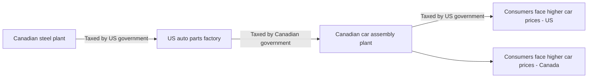

The diagram (Figure 1: Tariffs on intermediate goods amplify the impacts of tariffs on production costs and prices) follows a car's supply chain crossing the Canada–US border three times, with a tariff levied at each crossing, so that consumers in both countries end up facing higher car prices.

1. A Canadian steel plant ships steel to a US auto parts factory; the steel is taxed by the US government when it enters the US.
2. The US auto parts factory ships parts to a Canadian car assembly plant; the parts are taxed by the Canadian government when they enter Canada.
3. The Canadian car assembly plant exports finished cars to the United States; the cars are taxed by the US government, and US consumers face higher car prices.
4. The Canadian car assembly plant also sells cars domestically (no tariff at this step), and Canadian consumers face higher car prices too, because the tariffs paid earlier in the chain (US on the steel, Canada on the parts) have raised production costs.
5. Main message: taxing intermediate goods each time they cross the border compounds production costs, raising consumer prices on both sides of the border.
