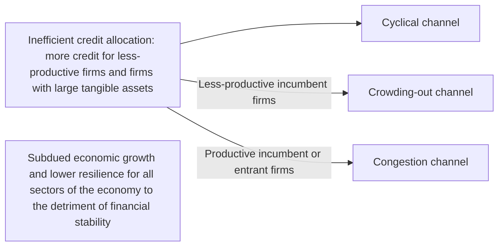

The diagram (Figure B.1, Transmission channels between credit allocation, productivity and financial stability; source: ECB staff) shows how inefficient credit allocation – more credit for less-productive firms and firms with large tangible assets – harms financial stability through three channels (cyclical, crowding-out and congestion), all ending in subdued growth and lower resilience.

1. Starting point: inefficient credit allocation – more credit goes to less-productive firms and firms with large tangible assets.
2. Cyclical channel: more loans extended to firms with weak productivity (thus more likely to have low debt repayment capacity) negatively affects banks' asset quality and triggers rising defaults in cyclical downturns.
3. Crowding-out channel (branch labelled "Less-productive incumbent firms"): bank funding diverted to less-productive firms might constrain business growth at productive firms.
4. Congestion channel (branch labelled "Productive incumbent or entrant firms"): investment by proactive incumbents is discouraged, new entrants are discouraged, less-productive firms gain market share, and the result is weak aggregate productivity growth.
5. Overall outcome (a bar spanning all three channels, not connected by arrows): subdued economic growth and lower resilience for all sectors of the economy, to the detriment of financial stability.
