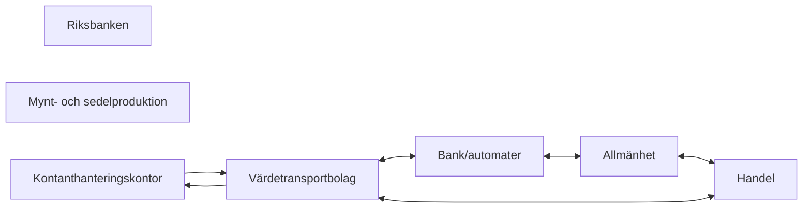

Figuren (Figur 1. Kontantkedjan) visar hur kontanter rör sig i Sverige: från kontanthanteringskontor via värdetransportbolag ut till banker/automater och handel, i cirkulation mellan dessa och allmänheten, och tillbaka till kontanthanteringskontoren – värdetransportbolagen är navet som alla fysiska flöden passerar.

1. Kedjans början består av Riksbanken, mynt- och sedelproduktion och kontanthanteringskontor, som visas som en egen grupp; inga pilar är ritade från Riksbanken eller från mynt- och sedelproduktionen.
2. Kontanthanteringskontor → Värdetransportbolag (enkelriktad pil): kontanter lämnar kontanthanteringskontoren via värdetransportbolagen.
3. Värdetransportbolag ↔ Bank/automater (dubbelriktad): kontanter levereras till och hämtas från banker och automater.
4. Värdetransportbolag ↔ Handel (dubbelriktad): handeln får kontanter levererade och lämnar ifrån sig dagskassor.
5. Bank/automater ↔ Allmänhet (dubbelriktad): allmänheten tar ut och sätter in kontanter.
6. Allmänhet ↔ Handel (dubbelriktad): kontanter används som betalning (och växel) i handeln.
7. Värdetransportbolag → Kontanthanteringskontor: en returpil (märkt med sedlar och mynt) visar att kontanter transporteras tillbaka till kontanthanteringskontoren, vilket sluter kretsloppet.
