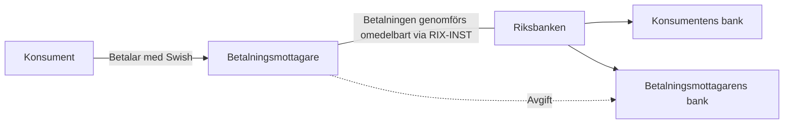

Figuren (Figur 3. Förenklad bild av en swishbetalning) visar att en konsument betalar en betalningsmottagare med Swish, att betalningen genomförs omedelbart via Riksbankens system RIX-INST mellan konsumentens bank och betalningsmottagarens bank, och att betalningsmottagaren betalar en avgift till sin bank.

1. Konsumenten betalar betalningsmottagaren med Swish i mobilen (pil från Konsument till Betalningsmottagare, märkt "Betalar med Swish").
2. Betalningen genomförs omedelbart via RIX-INST, Riksbankens system för avveckling av omedelbara betalningar; flödet går från betalningsmottagaren genom Riksbanken (linje utan pilspets).
3. Från Riksbanken förgrenas flödet med pilar till båda bankerna: konsumentens bank och betalningsmottagarens bank – avvecklingen sker mellan avsändarens och mottagarens bank.
4. Betalningsmottagaren betalar en avgift till sin egen bank (streckad pil märkt "Avgift" till Betalningsmottagarens bank). Konsumenten betalar ingen avgift i bilden.
