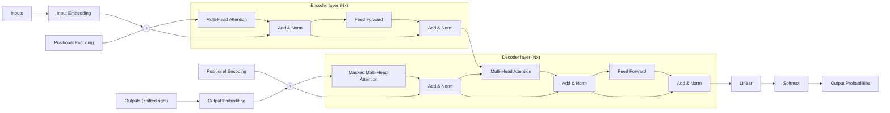

The diagram (Figure 1: The Transformer - model architecture) shows an encoder stack (left) and a decoder stack (right), each repeated N× and built from attention and feed-forward sub-layers wrapped in residual "Add & Norm" connections; the encoder output feeds the decoder's middle attention layer, and the decoder ends in Linear and Softmax to produce output probabilities.

1. Encoder: Inputs → Input Embedding; Positional Encoding is added (⊕).
2. The sum enters the encoder layer (repeated N×; N = 6 per the paper's text): it splits into three arrows into Multi-Head Attention (self-attention) plus a residual path; Add & Norm combines them.
3. Feed Forward follows, again with a residual connection into a second Add & Norm.
4. Decoder: Outputs (shifted right) → Output Embedding; Positional Encoding is added (⊕).
5. Decoder layer (repeated N×): Masked Multi-Head Attention (three inputs) + residual → Add & Norm.
6. Multi-Head Attention takes two inputs from the encoder output and one from the decoder's previous Add & Norm (encoder–decoder attention), + residual → Add & Norm.
7. Feed Forward + residual → Add & Norm.
8. The decoder output passes through Linear, then Softmax, giving Output Probabilities.
